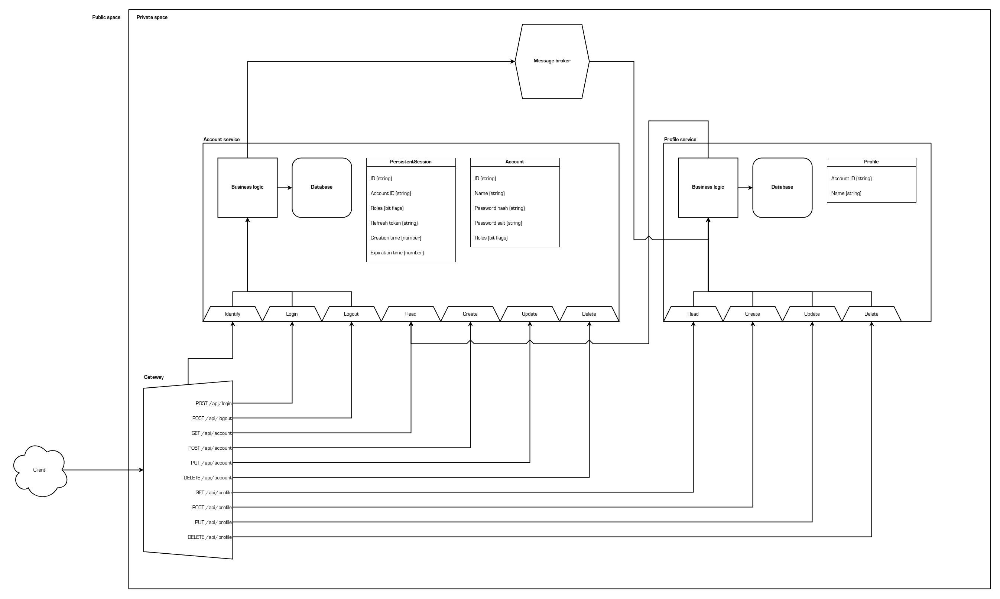
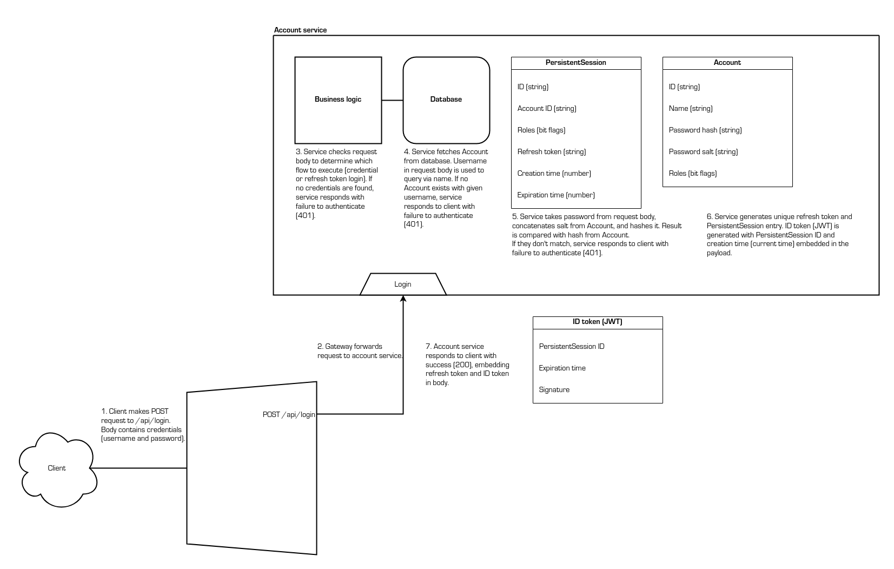
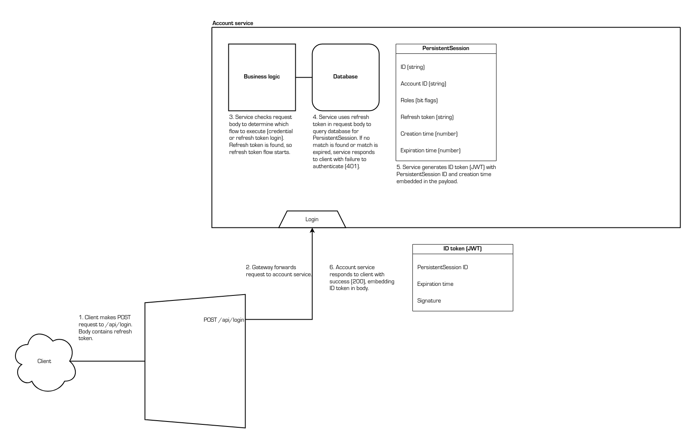
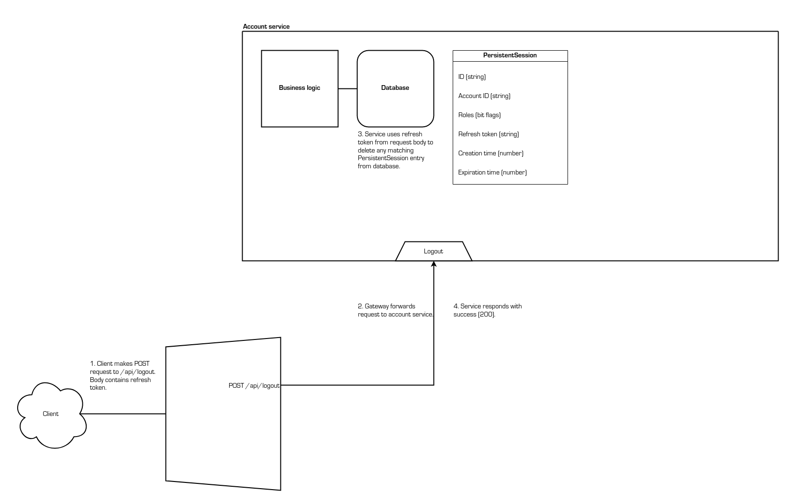

# Microservices foundation

This project serves as a foundation to build on top of when developing a
microservice-oriented HTTP API. Two services are provided:

- Authentication service
- User account service

These two services provide the following functionalities:

- User account creation
- Login
- Logout
- User account read, update, and delete (with access control)
- Granular access control over resources and other APIs

As application-specific services are introduced into this ecosystem, these nodes
can work with the information provided by the authentication service. There is
no need for the developer to fret over things like credentials and tokens; the
authentication service handles all of that entirely.

## Architecture



Upon an HTTP request arriving at the gateway, the gateway unconditionally
forwards it to the authentication service. The service constructs an authority
object, which contains the following information:

- The ID of the client's user account
- The roles held by the client's user account
- The time of the login that started this session

If the request does not contain a valid ID token, an empty authority object is
generated.

The authentication service sends this authority object back to the gateway,
which then forwards it to the request's original destination alongside the
request itself. The receiving service can then use this generated information to
determine whether the client is authorized to perform the actions detailed by
the request.

There are diagrams below that describe the flows in greater detail.

## Philosophy

This approach, as opposed to delegating the responsibility of request filtering
entirely to the authentication service, allows for granular access control that
can involve business logic. In essence, this architecture splits the duty of
access control between the authentication service and the destination service;
the former deals with identification, and the latter makes the final call based
on whatever rules it wishes to use. This frees the authentication service from
application-specific logic and keeps it widely applicable and lightweight while
still allowing the other services to operate without dealing with tokens and
other authentication-affiliated nonsense.

### Approach: front-loading access control

If the authentication service assumes the entire responsibility of access
control, there are two possible methods:

- The authentication services becomes tied down with business logic. This
  rapidly makes it increasingly complex and can easily create tight coupling
  between itself and other services. It also immediately eliminates reusability.
- The authentication does not use business logic at all, which means that the
  access control rules become very general.

### Approach: back-loading access control

If there is no authentication service, the individual services have to handle
each request in its raw form without any extra information. While this allows
for granular filtering, it hinders development, as each service is required to
handle authentication from scratch. This will also naturally cause duplicate
code amongst the services, as the authentication process will be very simliar if
not identical.

### Solution: shared responsibility

By splitting the responsibility of access control between the authentication
service and the destination service, the problems listed above are solved. The
authentication service can remain free from business logic and provide a common
method of client identification, and the other services are enabled to finely
filter through requests without understanding details like tokens. Each service
already understands its own domain, so it is best equipped to call the shot on
whether a request should be processed.

## Flows

### Login via credentials



### Generate new ID token via refresh token



### Logout



### Client identification


## Client-server communication

Although this foundation takes care of authentication on the back-end, an
understanding of the protocol is still required to develop a compatible client
application.

### All requests

To access restricted resources, the client must include the following header in
its request:

```
authorization: Bearer SOME_ID_TOKEN
```

`SOME_ID_TOKEN` should be replaced with the ID token received from the server.

Based on the identity and roles of the user that this ID token was generated
for, the destination service will decide whether to accept or deny the request.
Naturally, the content of the response is entirely dependent on this service.

### Login (generate new refresh token and ID token)

The client should send a `POST` request to the `/api/login` endpoint. The
request body must contain the user's credentials in JSON format as such:

```
{
  "name": "my_username",
  "password": "my_password"
}
```

If the credentials are valid, the server will respond with status code 200. The
body will contain the refresh and ID tokens in JSON format as such:

```
{
  "refreshToken": "some_refresh_token",
  "idToken": "some_id_token"
}
```

If the credentials are invalid, the server will respond with status code 401.

### Generate new ID token (using refresh token)

The client should send a `POST` request to the `/api/login` endpoint. The
request body must contain the refresh token in JSON format as such:

```
{
  "refreshToken": "some_refresh_token"
}
```

If the token is valid, the server will respond with status code 200. The body
will contain the ID token in JSON format as such:

```
{
  "idToken": "some_id_token"
}
```

If the token is invalid, the server will respond with status code 401.

### Logout

The client should send a `POST` request to the `/api/logout` endpoint. The
request body must contain the refresh token in JSON format as such:

```
{
  "refreshToken": "some_refresh_token"
}
```

The server will unconditionally respond with status code 200, even if the
request body is malformed and no action is taken.

Note that the ID token is not sent; there is no need to notify the server that
an ID token should be revoked. The authentication service treats an ID token as
invalid if its parent refresh token has been revoked.
