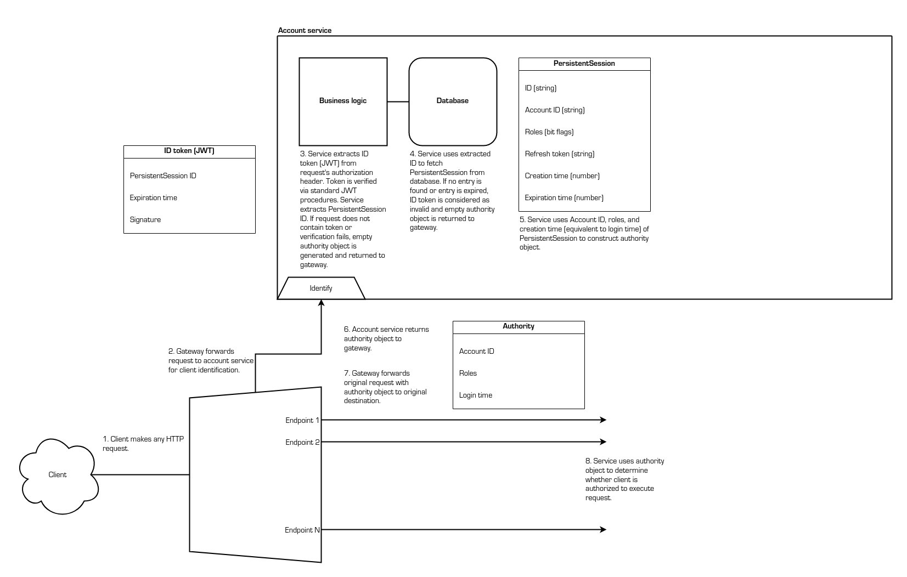

# Microservices foundation

This project serves as a foundation to build on top of when developing a
microservice-oriented HTTP API. Two services are provided:

- Authentication service
- User account service

These two services provide the following functionalities:

- User account creation
- Login
- ID token refresh
- Logout with proper token revocation
- User account read, update, and delete (with access control)
- Granular access control over resources and other APIs

As application-specific services are introduced into this ecosystem, these nodes
can work with the information provided by the authentication service. There is
no need for the developer to fret over things like credentials and tokens; the
authentication service handles all of that entirely.

## Architecture


Upon an HTTP request arriving at the gateway, the gateway unconditionally
forwards it to the authentication service. The service constructs an authority
object, which contains the following information:

- The ID of the client's user account
- The roles held by the client's user account
- The time of the login that started this session

If the request does not contain a valid ID token, an empty authority object is
generated.

The authentication service sends this authority object back to the gateway,
which then forwards it to the request's original destination alongside the
request itself. The receiving service can then use this generated information to
determine whether the client is authorized to perform the actions detailed by
the request.

There are diagrams below that describe the flows in greater detail.

## Configuration

It is extremely crucial that none of the services are directly accessible from
the public. The gateway should be the one and only node that is reachable by the
client. This is because each service operates with the assumption that every
incoming request has first been handled by the gateway and, as a result,
contains authority claims that can be trusted. If a service were to be directly
exposed to the public without the gateway's interference, any client could forge
a request with false authority claims and execute actions that would otherwise
be unauthorized.

Note that this can take many different forms, depending on how the services are
deployed:

- The most typical and straightforward setup would be to have each service
running on a dedicated machine. In this case, the machines would be operating
within the same private network, not accessible from outside the network. The
gateway would be the entry point that all clients interface with. For this
setup, the private network must be secured such that the services are not
directly reachable.

- For scenarios that expect lighter traffic and workloads, all services can run
on a single machine (as separate processes using different ports). This allows
the scope to be reduced, where the aforementioned "private network" becomes
`localhost` (internal communication within the same machine). This eliminates
the need for a dedicated private network; the system can define its trust
boundaries within the single machine. For this setup, the machine's firewall
must be configured to deny all requests headed for the services' ports while
allowing requests for the gateway's port.

Simply put, each service is ultimately a single process (or possibly a group of
processes, depending on how the service is built). Where these processes are
deployed is not important and can vary between applications. The key takeaways
are:

- Each service must be protected from direct requests from the public.
- Inter-service communication, as well as traffic between the gateway and
services, should be allowed and hidden from the public.
- The gateway should be exposed to the public.

## Internal communication

*This section is under construction.*

## Client-server communication

Although this foundation takes care of authentication on the back-end, an
understanding of the protocol is still required to develop a compatible client
application.

### All requests

To access restricted resources, the client must include the following header in
its request:

```
authorization: Bearer SOME_ID_TOKEN
```

`SOME_ID_TOKEN` should be replaced with the ID token received from the server.

Based on the identity and roles of the user that this ID token was generated
for, the destination service will decide whether to accept or deny the request.
Naturally, the content of the response is entirely dependent on this service.

### Login (generate new refresh token and ID token)

The client should send a `POST` request to the `/api/login` endpoint. The
request body must contain the user's credentials in JSON format as such:

```
{
  "credentials": {
    "name": "my_username",
    "password": "my_password"
  }
}
```

`my_username` and `my_password` should be replaced with the user's credentials.

If the credentials are valid, the server will respond with status code 200. The
body will contain the refresh and ID tokens in JSON format as such:

```
{
  "refreshToken": "some_refresh_token",
  "idToken": "some_id_token"
}
```

If the credentials are invalid, the server will respond with status code 401.

### Generate new ID token (using refresh token)

The client should send a `POST` request to the `/api/login` endpoint. The
request body must contain the refresh token in JSON format as such:

```
{
  "refreshToken": "some_refresh_token"
}
```

`some_refresh_token` should be replaced with the refresh token received from the
server.

If the token is valid, the server will respond with status code 200. The body
will contain the ID token in JSON format as such:

```
{
  "idToken": "some_id_token"
}
```

If the token is invalid, the server will respond with status code 401.

### Logout

The client should send a `POST` request to the `/api/logout` endpoint. The
request body should contain the refresh token in JSON format as such:

```
{
  "refreshToken": "some_refresh_token"
}
```

`some_refresh_token` should be replaced with the refresh token received from the
server.

The server will unconditionally respond with status code 200, even if the
refresh token is invalid or the request body is malformed and no action is
taken.

Note that the ID token is not sent; there is no need to notify the server that
an ID token should be revoked. The authentication service treats an ID token as
invalid if its parent refresh token has been revoked.

## Philosophy

When a request arrives, the server must make a decision on whether the request
should be accepted or denied. To make this decision, the following are required:

- The identity of the client and their roles (standard user, admin, etc.)
- An understanding of what the request is trying to do (private user data
access, admin-only action, etc.)
- The internal state of the application model (e.g. only users that have
completed some set of steps may execute some action)

With this in mind, the question, then, is: who should be responsible for making
this decision?

### Approach: Front-loading access control

"Front-loading" access control means pushing onto the authentication service the
entire responsibility of deciding whether to allow a request (enabling the other
services to operate with the assumption that all the requests that make it to
them are authorized). There are two separate ways to go about this:

- The authentication service is allowed to utilize business logic. This is
  required in order to understand what the request is trying to do as well as
  observe the state of the application model. Functionally, this fulfills the
  access control requirements, but it manifests an avalanche of issues from a
  development perspective:
  - Each time a new service is added to the system or an existing service is
  modified, the authentication service will have to be updated. This implies
  that there is tight coupling between the authentication service and the other
  services.
  - The authentication service will inevitably have to invoke other services to
  query for information that it requires in order to make its decision. This
  adds complexity and latency, and it again demonstrates tight coupling.
  - The authentication service will grow absolutely massive in both size and
  complexity, making it impossible to maintain.
- The authentication service is not allowed to utilize business logic. This
  means that it has no way of understanding the request's action and no way of
  observing the application model's state. This significantly reduces the
  granularity of access control, essentially rendering the authentication system
  useless for the vast majority of applications.

Neither option seems ideal.

### Approach: Back-loading access control

"Back-loading" access control means eliminating the authentication service
altogether. In this scenario, the individual services have to handle each
request in its raw form without any extra information. While this allows for
granular filtering, it hinders development and adds latency, as each service is
required to handle authentication from scratch. Additionally, in cases where a
service has to invoke another service, the invoked service will do redundant
authentication, adding even more latency. This is exacerbated by the fact that
service calls could potentially chain quite deep, adding this overhead many
times over. Ultimately, there is unnecessary duplication in both code and
runtime execution, not to mention the added complexity to each service.

This doesn't seem ideal either.

### Solution: Shared responsibility

By splitting the responsibility of access control between the authentication
service and the destination service, the problems listed above are solved.

1. The authentication service identifies the client and fetches their roles.
This information, along with the original request, is forwarded to the
destination service.
2. The destination service uses the identification information along with its
understanding of the request in the context of the application model to make the
final decision on whether the request should be accepted.

This setup brings the following benefits:

- The authentication service has no need to understand what the request is
trying to do. All it cares about is the authorization token provided in the
header. This completely frees the authentication service from having to
understand any business logic whatsoever. As a result, the authentication
service is lightweight, standalone, and reusable.
- The destination service is enabled to finely filter through requests without
the overhead of deciphering tokens and querying sessions. Each service already
understands its own domain, so there is no change in the scope that the service
operates within. Provided with the identification information from the
authentication service, it is well-equipped to make the final decision on
whether a request should be processed.

## Flows

### Login via credentials


### Generate new ID token via refresh token


### Logout


### Client identification



### Account delete


## Internal design of authentication service

*This section is under construction.*

## Internal design of user account service

*This section is under construction.*
